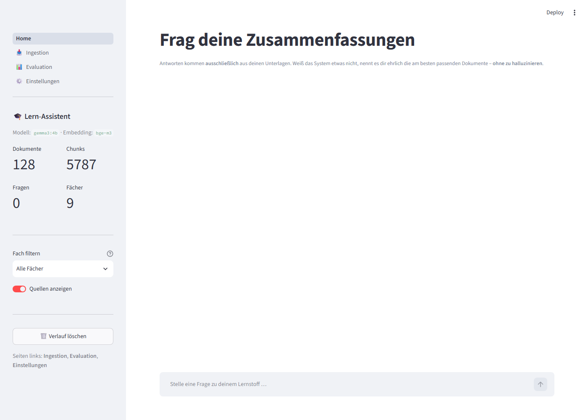
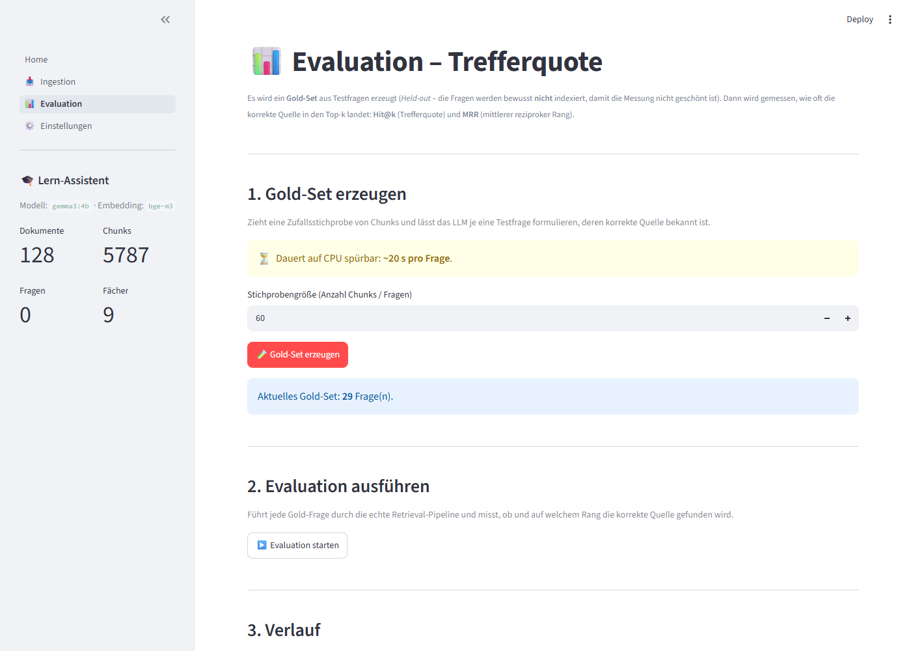

# RAG-Lernsystem – Frag deine Zusammenfassungen

[](https://www.python.org/)
[](LICENSE)
[](#datenschutz--deine-unterlagen-bleiben-lokal)

> **English (short):** A fully local, offline Retrieval-Augmented-Generation (RAG)
> study assistant. Drop your own lecture notes and summaries (PDF, Markdown, TXT,
> DOCX, PPTX) into a folder, ask questions, and get answers grounded **only in your
> own documents** — nothing is sent to the cloud. All models run locally via
> [Ollama](https://ollama.com). Hybrid search (dense `bge-m3` + BM25 + cross-encoder
> reranker), anti-hallucination via LangGraph, a Streamlit UI, and built-in
> hit-rate evaluation. Runs cross-platform on NVIDIA / AMD / Apple / Intel GPUs or
> plain CPU. Documentation is in German below.

---

Ein **vollständig lokales** Retrieval-Augmented-Generation-System (RAG) für die
Klausurvorbereitung. Du legst deine Zusammenfassungen (PDF, Markdown, TXT, DOCX,
PPTX) ab und stellst dem System Fragen dazu. Die Antworten kommen
**ausschließlich aus deinen eigenen Unterlagen** – nichts wird aus dem Internet
geladen, nichts an einen Cloud-Dienst geschickt. Alle Modelle laufen über
[Ollama](https://ollama.com) direkt auf deinem Rechner.

Das System ist bewusst auf **Faktentreue statt Wortgewandtheit** ausgelegt: Weiß
es etwas nicht, erfindet es keine Antwort, sondern nennt dir ehrlich die am
besten passenden Stellen in deinen Dokumenten.

---

## 🔒 Datenschutz – deine Unterlagen bleiben lokal

**Dieses Repository wird OHNE persönliche Dokumente veröffentlicht.** Deine
eigenen Kurs- und Klausurunterlagen bleiben ausschließlich auf deinem Rechner:

- Die Ordner `Zusammenfassungen/` und `Zusammenfassungen SoSE26/` sowie der
  komplette `data/`-Ordner (Index, Datenbank, Logs) sind über die `.gitignore`
  **vom Repo ausgeschlossen** – sie werden nie hochgeladen.
- Es gibt **keine** Netzwerk-Aufrufe zu Cloud-LLMs: LLM, Embedding und Reranker
  laufen lokal (Ollama bzw. `sentence-transformers`).
- Wer das Projekt klont, bekommt **nur Code und Anleitungen** und legt seine
  eigenen Unterlagen selbst an (siehe [Eigene Dokumente hinzufügen](#-eigene-dokumente-hinzufügen)).

> Kurz: **Deine Unterlagen bleiben lokal und kommen nicht ins Repository.**

---

## ✨ Funktionen im Überblick

- **Lokal & privat:** Antwort-LLM, ein schnelles Hilfsmodell und das Embedding
  (`bge-m3`) laufen über Ollama; Vektor-DB ist ein lokales ChromaDB. Kein Cloud-Zugriff.
- **Plattformübergreifend:** Ollama nutzt NVIDIA-, AMD- und Apple-GPUs
  automatisch; Intel-GPUs (Arc/iGPU) laufen über IPEX-LLM. Ohne GPU läuft alles
  auf der CPU (langsamer). Siehe [Plattform-/GPU-Unterstützung](#-plattform--gpu-unterstützung).
- **Hybrid-Retrieval für hohe Trefferquote:** Semantische Suche (dense, `bge-m3`)
  **plus** deutsche Keyword-Suche (BM25 mit Snowball-Stemming & Stoppwörtern),
  vereint per **Reciprocal Rank Fusion (RRF)** und final durch einen
  **Cross-Encoder-Reranker** (`BAAI/bge-reranker-v2-m3`) sortiert.
- **Anti-Halluzination:** niedrige Temperatur, strikte Prompts (nur aus dem
  Kontext antworten), Sentinel `KEINE_AUSREICHENDE_INFORMATION`, LLM-gestützte
  Faithfulness-Prüfung und ein ehrlicher **Fallback**, der statt zu raten die
  passendsten Dokumente nennt – orchestriert über einen **LangGraph**-Ablauf.
- **Automatische, resumierbare Ingestion:** Datei in den Ordner legen → laden →
  deduplizieren → chunken → einbetten → speichern. Optionaler Ordnerwächter
  (`watchdog`) indexiert neue Dateien automatisch.
- **Mehrstufige Deduplizierung:** Dokument-Ebene (SHA-256), Chunk-Ebene (exakt +
  near-duplicate per Embedding) und Retrieval-Zeit (Token-Jaccard).
- **Fragen-Indexierung (Hypothetical Questions):** optional erzeugte
  Prüfungsfragen pro Chunk erhöhen die Trefferquote.
- **Klausur-Lernkatalog:** aus Zusammenfassungen + Altklausuren generierbar
  (`cli catalog <Fach>`).
- **Eingebaute Evaluation:** Held-out-Gold-Set → **Hit@k / MRR** messen, um
  **datenbasiert nachzujustieren**.
- **Schicke Weboberfläche (Streamlit)** und eine vollständige **CLI**.

**Gemessene Qualität** (Held-out-Gold-Set, Retrieval): **Hit@3 = 82,8 %**,
**Hit@10 = 96,5 %**. Methodik: [docs/EVALUATION.md](docs/EVALUATION.md).

---

## 📸 Screenshots

**Chat — Fragen stellen, belegte Antworten mit Quellenangaben:**



**Hardware-Erkennung & Modell-Auswahl — automatische Empfehlung + Benchmark:**


**Evaluation — Trefferquote messen und nachjustieren:**



---

## 🚀 Schnellstart

Voraussetzungen: **Python 3.13**, **[Ollama](https://ollama.com)** installiert.
Die One-Click-Installer richten die passende Ollama-Variante und ein zur
Hardware passendes Modell automatisch ein.

```bash
# 1) Repository klonen
git clone <REPO-URL>
cd rag-lernsystem
```

**Windows (PowerShell):**

```powershell
# 2) One-Click-Installer (venv, Abhängigkeiten, Ollama-Variante, Modell)
./install.ps1

# 3) Starten (öffnet die Weboberfläche unter http://localhost:8501)
./Start.bat
```

**Linux / macOS:**

```bash
# 2) One-Click-Installer
./install.sh

# 3) Starten
./start.sh
```

> ℹ️ Die Installer `install.ps1` / `install.sh` erkennen deine Hardware
> (CPU/GPU-Hersteller, RAM/VRAM) und richten **automatisch** die richtige
> Ollama-Variante (Standard bzw. IPEX-LLM für Intel) und ein passendes Modell
> ein. Manuelle Einrichtung von Grund auf: [docs/SETUP.md](docs/SETUP.md).

Danach zum ersten Mal deine Dokumente indexieren – siehe
[Eigene Dokumente hinzufügen](#-eigene-dokumente-hinzufügen).

### Doppelklick-Starthilfen (Windows)

| Datei                        | Zweck                                                     |
| ---------------------------- | --------------------------------------------------------- |
| `Start.bat`                  | Startet die Streamlit-Chat-Oberfläche im Browser.         |
| `Dokumente_importieren.bat`  | Liest alle Dateien aus dem Quellordner ein (resumierbar). |
| `Auto_Ueberwachung.bat`      | Ordnerwächter: neue Dateien werden automatisch indexiert. |

Die tägliche Bedienung ist in [docs/BEDIENUNG.md](docs/BEDIENUNG.md) beschrieben.

---

## 🖥️ Plattform-/GPU-Unterstützung

Ollama wählt die Beschleunigung meist automatisch. Der Installer richtet die
passende Variante ein.

| Plattform / GPU        | Ollama-Variante             | Beschleunigung | Läuft so                              |
| ---------------------- | --------------------------- | -------------- | ------------------------------------- |
| **NVIDIA** (Win/Linux) | Standard-Ollama             | CUDA           | Automatisch, schnell                  |
| **AMD** (Linux, teils Win) | Standard-Ollama         | ROCm / Vulkan  | Automatisch, schnell                  |
| **Apple Silicon** (M-Serie) | Standard-Ollama        | Metal          | Automatisch, schnell (unified memory) |
| **Intel** (Arc / iGPU) | **IPEX-LLM-Ollama** (SYCL)  | Level-Zero     | Sonderweg, siehe [GPU_BESCHLEUNIGUNG.md](docs/GPU_BESCHLEUNIGUNG.md) |
| **Nur CPU**            | Standard-Ollama             | –              | Funktioniert überall, aber **langsam** |

**Ehrlicher Performance-Hinweis:** Auf einer echten GPU sind Antworten schnell
(oft **< 30 s**, je nach Modell und Frage). **Nur auf der CPU ist es deutlich
langsamer** – je nach CPU/Modell von einigen zehn Sekunden bis zu mehreren
Minuten pro Antwort, weil die volle Pipeline (Embedding → Retrieval → Reranker →
LLM → optionaler Faithfulness-Check) rein auf der CPU läuft. Kleineres Modell +
`ENABLE_FAITHFULNESS_CHECK = false` beschleunigen spürbar. Details:
[docs/GPU_BESCHLEUNIGUNG.md](docs/GPU_BESCHLEUNIGUNG.md) und
[docs/SETUP.md](docs/SETUP.md).

---

## 🤖 Modell wählen

Das **Embedding-Modell ist fix `bge-m3`** (multilingual, 1024-dim). Das
**Antwort-LLM ist frei wählbar** und hängt von deiner Hardware ab.

**Automatische Empfehlung + Test (empfohlen):**

```bash
# Hardware messen und ein passendes Modell empfehlen
python -m ragapp.scripts.cli recommend

# Empfohlenes Modell laden, benchmarken (tok/s) und als Standard setzen
python -m ragapp.scripts.cli recommend --test --set

# Konkretes Modell testen/setzen
python -m ragapp.scripts.cli recommend --model qwen2.5:7b-instruct --set
```

`recommend` erkennt CPU/GPU, RAM/VRAM und schlägt ein passendes Modell vor,
z. B. `qwen2.5:3b-instruct` / `gemma3:4b` (klein/schnell),
`qwen2.5:7b-instruct` (mittel) oder `gemma3:12b` (groß). In der **Streamlit-
Oberfläche** gibt es zusätzlich einen **Modell-Picker** auf der
Einstellungen-Seite – dort lässt sich das Modell ohne CLI wechseln.

Lizenzen der Modelle: siehe [NOTICE.md](NOTICE.md).

---

## 📥 Eigene Dokumente hinzufügen

1. **Pro Fach einen Unterordner** unter `Zusammenfassungen/` anlegen und deine
   Dateien (PDF, MD, TXT, DOCX, PPTX) hineinlegen:

   ```
   Zusammenfassungen/
   ├─ Analysis/
   │  ├─ Vorlesung_01.pdf
   │  └─ Zusammenfassung.md
   └─ Statistik/
      └─ Formelsammlung.pdf
   ```

2. **Indexieren:**

   ```bash
   python -m ragapp.scripts.cli ingest --dir ./Zusammenfassungen
   ```

   Der Import ist **resumierbar** – bereits eingelesene, unveränderte Dateien
   werden übersprungen. Alternativ per Doppelklick: `Dokumente_importieren.bat`.

3. **Fragen stellen** – über die Oberfläche (`Start.bat` / `start.sh`) oder per CLI:

   ```bash
   python -m ragapp.scripts.cli ask "Was ist ein Deckungsbeitrag?"
   ```

> Hinweis: Der im Code voreingestellte Quellordner ist `Zusammenfassungen SoSE26/`
> (`ragapp/config.py`, `SOURCE_DIR`). Du kannst entweder diesen Ordner nutzen
> oder mit `--dir` auf einen beliebigen Ordner (z. B. `./Zusammenfassungen`)
> zeigen. **Beide Ordner sind per `.gitignore` vom Repo ausgeschlossen.**

---

## 🏗️ Architektur (Kurzüberblick)

```
                         ┌───────────────────────── INGESTION ─────────────────────────┐
   Zusammenfassungen     │  Laden → Dedup(Dokument) → Chunking → Dedup(Chunk, exakt)    │
   (PDF/MD/TXT/…)  ──────▶  → Embeddings (bge-m3) → Dedup(Chunk, near-dup) →            │
                         │  [optional: Fragen] → ChromaDB + BM25-Index + Manifest       │
                         └──────────────────────────────────────────────────────────────┘
                                                     │
                                          ┌──────────▼──────────┐
                                          │  ChromaDB (cosine)  │   +   BM25-Index   +   Manifest (SQLite)
                                          └──────────▲──────────┘
                                                     │
   ┌────────────────────────────── QUERY (LangGraph) ─────────────────────────────────┐
   │                                                                                    │
   │  Frage ─▶ retrieve ─▶ [Relevanz-Gate] ─▶ generate ─▶ faithfulness ─▶ Antwort       │
   │            │  Dense + BM25 → RRF → Near-Dup → Rerank      │                         │
   │            └──────────── zu schwach ──▶ fallback ◀── nicht belegt / "weiß nicht" ──┘
   │                              (nennt die besten Fundstellen statt zu halluzinieren) │
   └────────────────────────────────────────────────────────────────────────────────────┘
```

Ausführliche Erklärung: [docs/ARCHITEKTUR.md](docs/ARCHITEKTUR.md).

---

## 📁 Projektstruktur (Kurzform)

```
./
├─ ragapp/                     # Python-Paket mit der gesamten Logik
│  ├─ config.py                #   Zentrale Konfiguration (alle Parameter)
│  ├─ hardware.py              #   Hardware-Erkennung + Modell-Empfehlung (recommend)
│  ├─ ingestion/               #   Loader, Chunking, Dedup, Fragen, Pipeline, Watcher
│  ├─ retrieval/               #   Embeddings, ChromaDB, BM25, Reranker, Hybrid-Suche
│  ├─ graph/                   #   LangGraph: retrieve→generate→faithfulness→fallback
│  ├─ eval/                    #   Gold-Set, Hit@k / MRR, Evaluations-Runner
│  ├─ scripts/cli.py           #   CLI: ingest, watch, gold, eval, ask, recommend, doctor …
│  └─ ui/Home.py               #   Streamlit-Chat-Oberfläche
├─ docs/                       # Dokumentation (siehe unten)
├─ Zusammenfassungen/          # DEINE Dokumente (lokal, nicht im Repo) – nur .gitkeep
├─ data/                       # Lokal erzeugte Daten (Index/DB/Logs) – nicht im Repo
├─ .streamlit/config.toml      # Streamlit-Konfiguration
├─ install.ps1 / install.sh    # One-Click-Installer (Windows / Linux/macOS)
├─ Start.bat / start.sh        # Starter für die Oberfläche
├─ requirements.txt
└─ *.bat                       # weitere Doppelklick-Starthilfen (Windows)
```

---

## 📚 Dokumentation

| Dokument                                                   | Inhalt                                                                 |
| ---------------------------------------------------------- | ---------------------------------------------------------------------- |
| [docs/SETUP.md](docs/SETUP.md)                             | Installation von Grund auf (Ollama, venv, torch-CPU) + Troubleshooting |
| [docs/BEDIENUNG.md](docs/BEDIENUNG.md)                     | Alltagsnutzung: Fragen stellen, Dokumente hinzufügen, alle CLI-Befehle |
| [docs/ARCHITEKTUR.md](docs/ARCHITEKTUR.md)                 | Tiefe technische Doku: Datenflüsse, Retrieval-Pipeline, LangGraph      |
| [docs/TUNING.md](docs/TUNING.md)                           | Trefferquote verbessern: jeder Parameter, Workflow, Symptom-Tabelle    |
| [docs/EVALUATION.md](docs/EVALUATION.md)                   | Methodik der Trefferquoten-Messung (Gold-Set, Hit@k, MRR, Grenzen)     |
| [docs/GPU_BESCHLEUNIGUNG.md](docs/GPU_BESCHLEUNIGUNG.md)   | GPU-Beschleunigung, speziell Intel-Arc/iGPU via IPEX-LLM               |
| [docs/QUALITAETSSICHERUNG.md](docs/QUALITAETSSICHERUNG.md) | Qualitätssicherung: Tests, Prüfungen, Abnahmekriterien                 |

---

## ⚙️ Verwendete Modelle (alle lokal über Ollama)

| Rolle                 | Modell (Beispiel-Tag)     | Aufgabe                                                  |
| --------------------- | ------------------------- | ------------------------------------------------------- |
| Haupt-LLM             | via `recommend` wählbar   | finale Antwortgenerierung, Faithfulness-Prüfung         |
| Hilfsmodell (schnell) | kleines LLM               | Fragen-Generierung, Gold-Set-Erzeugung                  |
| Embedding             | `bge-m3` (1024-dim)       | multilinguale Vektor-Einbettung (dense Retrieval)       |
| Reranker              | `BAAI/bge-reranker-v2-m3` | Cross-Encoder (via `sentence-transformers`, lädt lokal) |

Der Reranker wird beim ersten Aufruf über `sentence-transformers` heruntergeladen
und dann lokal ausgeführt. Schlägt das fehl, fällt das System automatisch auf die
Fusions-Reihenfolge zurück und bleibt funktionsfähig. Modell-Lizenzen und deine
Verantwortung dafür: [NOTICE.md](NOTICE.md).

---

## 📄 Lizenz

Der **Code** steht unter der **MIT-Lizenz** – siehe [`LICENSE`](LICENSE).
Die **Modelle** haben **eigene Lizenzen** (Gemma Terms, Qwen/Apache-2.0, bge-m3
MIT) und werden über Ollama bzw. Hugging Face geladen – für deren Einhaltung bist
du selbst verantwortlich. Details: [NOTICE.md](NOTICE.md).
