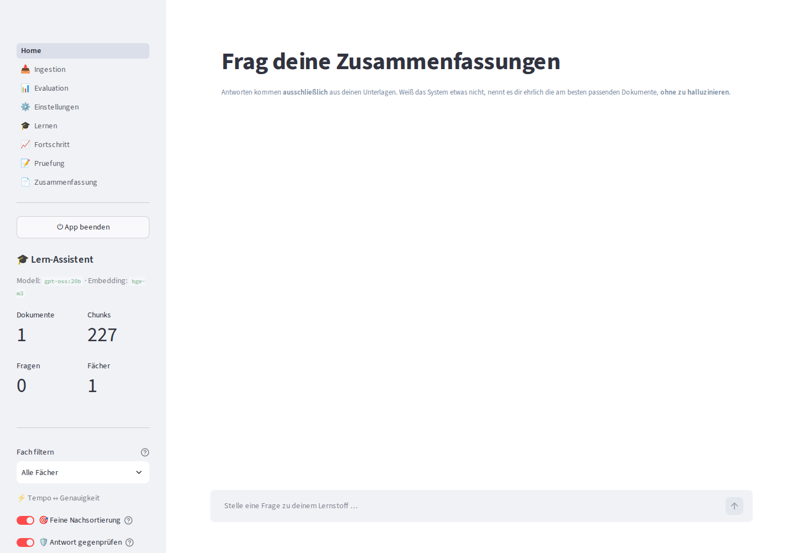
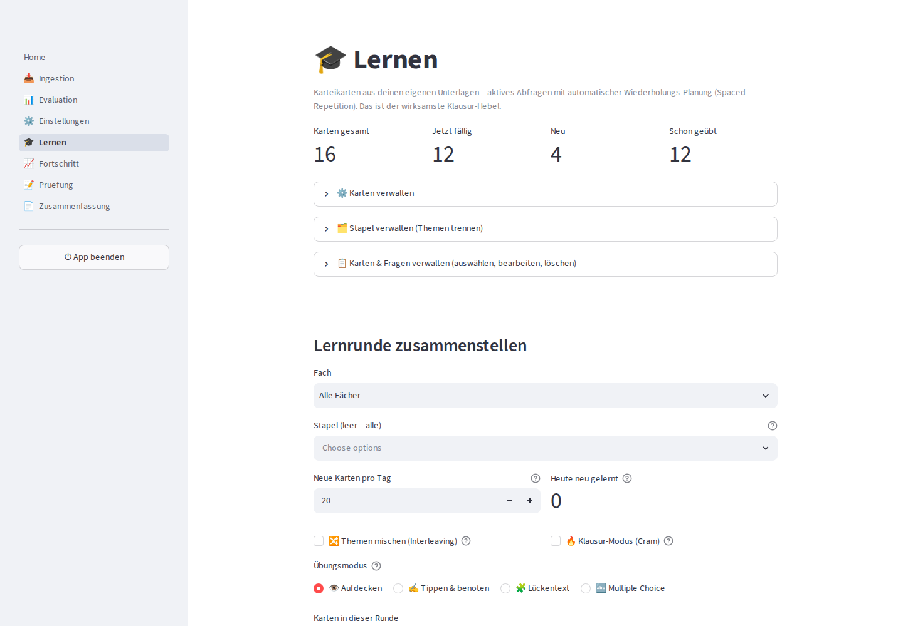
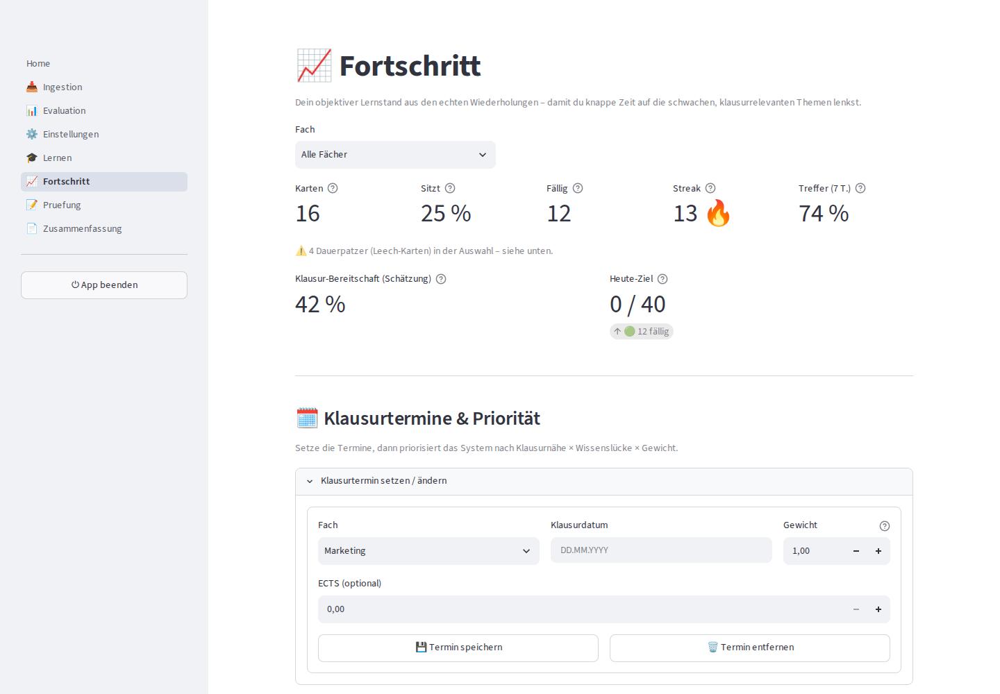
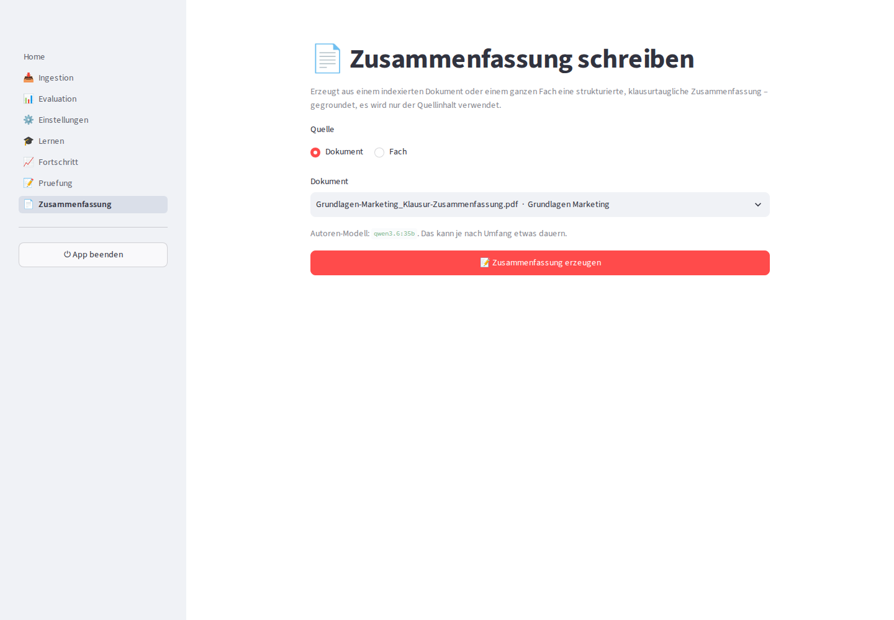
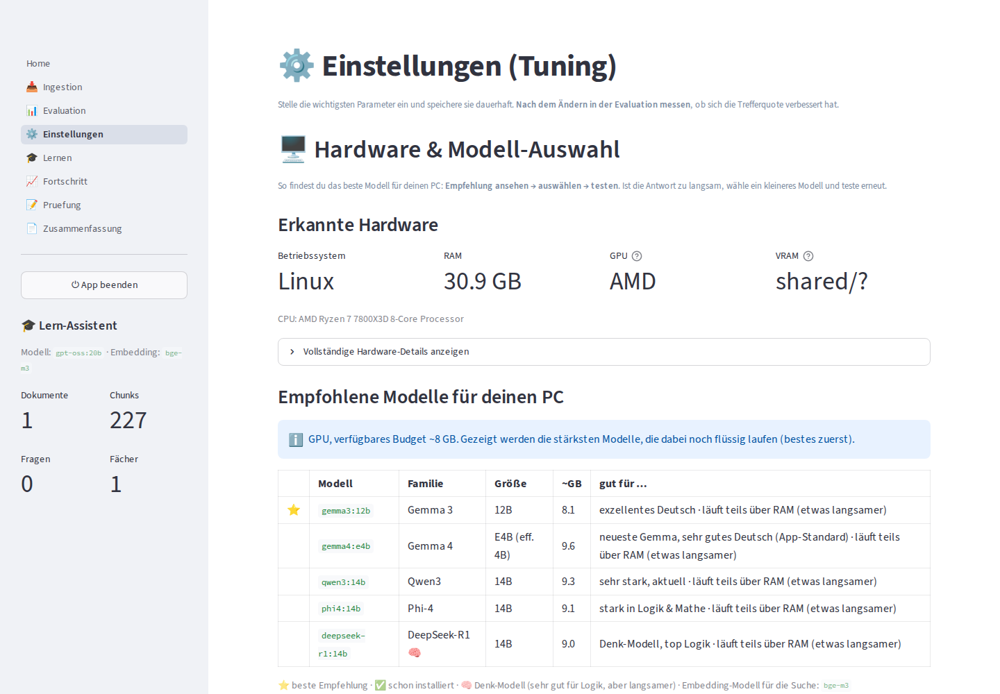
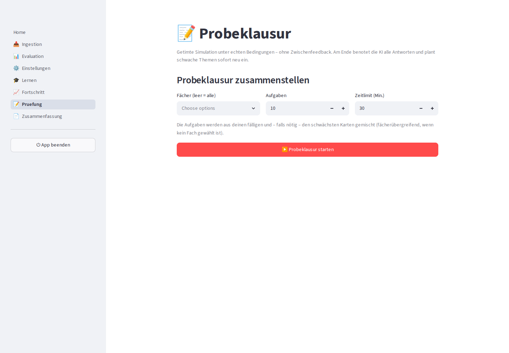

<div align="center">


# RAG-Lernsystem

**Frag deine Unterlagen · Lern mit Karteikarten · 100 % lokal & offline**

Ein lokaler KI-Lernassistent für **Studierende, Forschende und alle, die mit vertraulichen Unterlagen arbeiten** (Medizin, Jura, Firmen-Know-how). Antworten kommen **nur aus deinen eigenen Dokumenten**, dazu Karteikarten mit Spaced Repetition – **nichts verlässt deinen Rechner**.

[](https://www.python.org/)
[](LICENSE)
[](#-datenschutz-deine-unterlagen-bleiben-lokal)
[](docs/EVALUATION.md)
[](#-plattform-gpu-unterstützung)

</div>

> **English (short):** A fully local, offline Retrieval-Augmented-Generation (RAG)
> study assistant. Drop your own lecture notes (PDF, Markdown, TXT, DOCX, PPTX)
> into a folder, ask questions, and get answers grounded **only in your own
> documents** – nothing is sent to the cloud. It also turns your material into
> **flashcards with spaced repetition (SM-2)** for active recall. All models run
> locally via [Ollama](https://ollama.com): hybrid search (dense `bge-m3` + BM25 +
> cross-encoder reranker), anti-hallucination via LangGraph, a Streamlit UI, and
> built-in hit-rate evaluation. Runs on NVIDIA / AMD / Apple / Intel GPUs or plain
> CPU. Full documentation below is in German.

---

Ein **vollständig lokales** Retrieval-Augmented-Generation-System (RAG) für die
Klausurvorbereitung. Du legst deine Zusammenfassungen und Skripte ab, stellst
Fragen dazu und lässt dir daraus Karteikarten zum Üben erzeugen. Die Antworten
kommen **ausschließlich aus deinen eigenen Unterlagen** – nichts wird aus dem
Internet geladen, nichts an einen Cloud-Dienst geschickt. Alle Modelle laufen
über [Ollama](https://ollama.com) direkt auf deinem Rechner.

Das System ist bewusst auf **Faktentreue statt Wortgewandtheit** ausgelegt: Weiß
es etwas nicht, erfindet es keine Antwort, sondern nennt dir ehrlich die am
besten passenden Stellen in deinen Dokumenten.

### Warum das – und nicht ChatGPT oder NotebookLM?

Kostenlose Cloud-Tools können vieles davon auch. Der Unterschied liegt in drei
Punkten, die sie **nicht** bieten:

- **Läuft komplett offline auf deinem Rechner.** Keine Uploads, kein Konto, keine
  Datenkrake. Deine (womöglich vertraulichen) Unterlagen verlassen den PC nie –
  relevant z. B. für Medizin-, Jura- oder Praxismaterial mit Geheimhaltung.
- **Ehrlich statt geschwätzig.** Mehrstufige Anti-Halluzination: Findet das System
  keinen Beleg, sagt es das – statt plausibel klingenden Unsinn zu erfinden.
- **Auf Deutsch optimiert.** Deutsche Keyword-Suche (BM25 + Stemming), Formeln
  bleiben als sauberes LaTeX erhalten (wichtig für MINT), multilinguales Embedding.

Dazu ein **aktiver Lern-Layer** (Karteikarten + Spaced Repetition), der aus dem
Nachschlage-Werkzeug ein echtes Übe-Werkzeug macht.

---

## 🔒 Datenschutz: deine Unterlagen bleiben lokal

**Dieses Repository wird OHNE persönliche Dokumente veröffentlicht.** Deine
eigenen Kurs- und Klausurunterlagen bleiben ausschließlich auf deinem Rechner:

- Die Ordner `Zusammenfassungen/` und `Zusammenfassungen SoSE26/` sowie der
  komplette `data/`-Ordner (Index, Datenbank, Logs) sind über die `.gitignore`
  **vom Repo ausgeschlossen** – sie werden nie hochgeladen.
- Es gibt **keine** Netzwerk-Aufrufe zu Cloud-LLMs: LLM, Embedding und Reranker
  laufen lokal (Ollama bzw. `sentence-transformers`).
- Wer das Projekt klont, bekommt **nur Code und Anleitungen** und legt seine
  eigenen Unterlagen selbst an (siehe [Eigene Dokumente hinzufügen](#-eigene-dokumente-hinzufügen)).

> Kurz: **Deine Unterlagen bleiben lokal und kommen nicht ins Repository.**

---

## ✨ Funktionen im Überblick

- **Lokal & privat:** Antwort-LLM, ein schnelles Hilfsmodell und das Embedding
  (`bge-m3`) laufen über Ollama; Vektor-DB ist ein lokales ChromaDB. Kein Cloud-Zugriff.
- **Fragen an deine Unterlagen:** Antworten **nur aus deinen Dokumenten**, mit
  Quellenangabe – als Chat-Oberfläche oder per CLI.
- **🎓 Karteikarten & Spaced Repetition (SM-2):** aus dem indexierten Fragenmaterial
  werden Lernkarten geerntet und mit verteiltem Wiederholen (wie bei Anki) geplant.
  Aktives Abfragen (*Gewusst / Halb / Nicht gewusst*) – **komplett offline, ohne
  LLM zur Laufzeit**. Der wirksamste Klausur-Hebel.
- **📈 Lernstand & Klausur-Planung:** Die Seite **Fortschritt** zeigt aus deinen echten
  Wiederholungen Mastery, Vergessenskurve, Streak, Dauerpatzer (*Leeches*) und eine
  geschätzte **Klausur-Bereitschaft**; mit Klausurterminen priorisiert das System nach
  *Nähe × Wissenslücke × Gewicht* (inkl. `.ics`-Export).
- **📝 Probeklausur:** getimte Prüfungssimulation aus deinen Karten (Tippen & Benoten,
  Multiple Choice, Lückentext).
- **📄 Zusammenfassung schreiben:** erzeugt aus einem Dokument/Fach eine strukturierte,
  **gegroundete** Markdown-Zusammenfassung – mit einem separat wählbaren, großen
  **Autoren-Modell** (`LLM_MODEL_AUTHOR`), während der interaktive Chat auf einem
  schnellen Modell bleibt (kein Modell-Wechsel mitten in der Antwort).
- **Hybrid-Retrieval für hohe Trefferquote:** Semantische Suche (dense, `bge-m3`)
  **plus** deutsche Keyword-Suche (BM25 mit Snowball-Stemming & Stoppwörtern),
  vereint per **Reciprocal Rank Fusion (RRF)** und final durch einen
  **Cross-Encoder-Reranker** (`BAAI/bge-reranker-v2-m3`) sortiert.
- **Anti-Halluzination:** niedrige Temperatur, strikte Prompts (nur aus dem
  Kontext antworten), Sentinel `KEINE_AUSREICHENDE_INFORMATION`, LLM-gestützte
  Faithfulness-Prüfung und ein ehrlicher **Fallback**, der statt zu raten die
  passendsten Dokumente nennt – orchestriert über einen **LangGraph**-Ablauf.
- **Automatische, resumierbare Ingestion:** Datei in den Ordner legen → laden →
  deduplizieren → chunken → einbetten → speichern. Optionaler Ordnerwächter
  (`watchdog`) indexiert neue Dateien automatisch.
- **Mehrstufige Deduplizierung:** Dokument-Ebene (SHA-256), Chunk-Ebene (exakt +
  near-duplicate per Embedding) und Retrieval-Zeit (Token-Jaccard).
- **Fragen-Indexierung (Hypothetical Questions):** optional erzeugte
  Prüfungsfragen pro Chunk erhöhen die Trefferquote und speisen die Karteikarten.
- **Klausur-Lernkatalog:** aus Zusammenfassungen + Altklausuren generierbar
  (`cli catalog <Fach>`).
- **Eingebaute Evaluation:** Held-out-Gold-Set → **Hit@k / MRR** messen, um
  **datenbasiert nachzujustieren**.
- **Plattformübergreifend:** Ollama nutzt NVIDIA-, AMD- und Apple-GPUs
  automatisch; Intel-GPUs (Arc/iGPU) laufen über IPEX-LLM. Ohne GPU läuft alles
  auf der CPU (langsamer). Siehe [Plattform-/GPU-Unterstützung](#-plattform-gpu-unterstützung).
- **Schicke Weboberfläche (Streamlit)** und eine vollständige **CLI**.

**Gemessene Qualität** (Held-out-Gold-Set, Retrieval): **Hit@3 = 82,8 %**,
**Hit@10 = 96,5 %**. Methodik und Grenzen (kleine Stichprobe): [docs/EVALUATION.md](docs/EVALUATION.md).

---

## 📸 Screenshots

**Chat – Fragen an deine Unterlagen, belegte Antworten mit Quellenangaben**



**🎓 Lernen – Karteikarten mit Spaced Repetition (SM-2) und vier Übungsmodi: Aufdecken, Tippen & Benoten, Lückentext, Multiple Choice**



**📈 Fortschritt – objektiver Lernstand aus echten Wiederholungen: Mastery, Streak, Klausur-Bereitschaft, Leech-Erkennung und Klausurtermin-Priorisierung**



**📄 Zusammenfassung schreiben – gegroundete Markdown-Zusammenfassung je Dokument/Fach (großes „Autoren"-Modell, nur aus deinen Inhalten)**



**⚙️ Einstellungen – automatische Hardware-Erkennung & Modellwahl, tok/s-Benchmark und alle Tuning-Parameter**



**📝 Probeklausur – getimte Prüfungssimulation aus deinen Karten**



---

## 🚀 Schnellstart

**Einzige Voraussetzung: Python 3.10 oder neuer** ([python.org](https://www.python.org/downloads/),
beim Installieren **„Add Python to PATH" anhaken!**). **Ollama musst du NICHT
vorher installieren** – der Installer erledigt das (bei Intel-GPUs lädt er
automatisch die IPEX-LLM-Variante, sonst richtet er die Standard-Ollama ein).

```bash
# Repository holen: klonen ODER auf GitHub "Code -> Download ZIP" + entpacken
git clone https://github.com/edgebird-lab/RAG_System.git
cd RAG_System
```

**Windows – Variante 1: fertiger Installer (am einfachsten)**

1. **`RAG-Lernsystem-Setup.exe`** von der [Releases-Seite](https://github.com/edgebird-lab/RAG_System/releases) laden und starten.
2. Dem Assistenten folgen und am Ende **„Einrichtung ausführen"** anhaken – der Installer **erkennt automatisch deine Hardware (GPU/RAM)** und richtet die passende Ollama-Variante **plus ein passendes Modell** ein (auf schwächeren Laptops ein kleineres). Dieser einmalige Schritt dauert **~20–40 Min**.
3. Danach über die **Startmenü-/Desktop-Verknüpfung** starten – **lautlos, ohne Konsolenfenster**.

**Windows – Variante 2: aus dem Quellcode**

1. Repo klonen (siehe oben) oder auf GitHub **„Code → Download ZIP"**.
2. Doppelklick auf **`Installieren.bat`** (richtet venv, Abhängigkeiten, Ollama & Modell ein), dann **`Start.bat`** → http://localhost:8501.

> Beim allerersten Download kann Windows warnen (SmartScreen/„Unbekannter Herausgeber"). Das ist bei neuer, **noch nicht signierter** Software normal und **kein Virus** → „Weitere Informationen" → „Trotzdem ausführen". Details: [Warnt Windows beim Start?](#-warnt-windows-beim-start-kein-virus).

**Linux / macOS:**

Entweder das fertige Quellpaket **`RAG-Lernsystem-Linux.tar.gz`** von der
GitHub-Release-Seite herunterladen **oder** das Repository klonen – dann den
One-Click-Installer ausführen:

```bash
# Variante A – Quellpaket (Release-Seite):
tar xzf RAG-Lernsystem-Linux.tar.gz
cd RAG-Lernsystem

# Variante B – geklont:
#   git clone https://github.com/edgebird-lab/RAG_System.git && cd RAG_System

bash install.sh   # erkennt Hardware, baut die venv, installiert Ollama + ein
                  # passendes Modell; unter Linux wird zusätzlich ein Menü-/
                  # Desktop-Starter (Icon) angelegt
./start.sh        # startet die Oberfläche unter http://localhost:8501
```

> ℹ️ Die Installer `install.ps1` / `install.sh` erkennen deine Hardware
> (CPU/GPU-Hersteller, RAM/VRAM) und richten **automatisch** die richtige
> Ollama-Variante (Standard bzw. IPEX-LLM für Intel) und ein passendes Modell
> ein. Manuelle Einrichtung von Grund auf: [docs/SETUP.md](docs/SETUP.md).
>
> Das Quellpaket erzeugst du selbst mit `bash build_linux.sh` (nutzt `git archive`
> – enthält nur den Quellcode, **keine** persönlichen Unterlagen/Datenbank).

Danach zum ersten Mal deine Dokumente indexieren, siehe
[Eigene Dokumente hinzufügen](#-eigene-dokumente-hinzufügen).

### 🖥️ Auf zwei Bildschirmen nutzen

Die App lässt sich in **zwei Fenstern gleichzeitig** öffnen (z. B. je Bildschirm) –
beide teilen sich denselben Server und dasselbe KI-Modell, es wird also **kein**
Speicher/Modell doppelt geladen. Zwei Wege:

- In der App links in der Seitenleiste auf **„🖥️ Zweites Fenster öffnen"** klicken.
  Das neue Fenster erscheint automatisch auf dem zweiten Bildschirm (falls
  vorhanden).
- Oder einfach das **Desktop-Icon erneut anklicken** – erkennt die laufende
  Instanz und öffnet nur ein weiteres Fenster.

Beim Schließen bleibt die App aktiv, solange **noch ein Fenster offen** ist; erst
das Schließen des letzten Fensters (oder **„⏻ App beenden"**) stoppt Server und
KI-Modell.

### Doppelklick-Starthilfen (Windows)

| Datei                        | Zweck                                                     |
| ---------------------------- | --------------------------------------------------------- |
| `Installieren.bat`           | Richtet alles ein (venv, Abhängigkeiten, Ollama, Modell). |
| `Start.bat`                  | Startet die Chat-Oberfläche im Browser (mit Konsole).     |
| `Start_Handy-Zugriff.bat`    | Startet zusätzlich mit Zugriff aus dem eigenen WLAN.       |
| `Start_Unterwegs.bat`        | Startet mit Zugriff von unterwegs (Cloudflare-Tunnel).    |
| `Dokumente_importieren.bat`  | Liest alle Dateien aus dem Quellordner ein (resumierbar). |
| `Auto_Ueberwachung.bat`      | Ordnerwächter: neue Dateien werden automatisch indexiert. |

Die tägliche Bedienung ist in [docs/BEDIENUNG.md](docs/BEDIENUNG.md) beschrieben.

---

## 🛡️ Warnt Windows beim Start? (kein Virus)

Beim ersten Ausführen der `RAG-Lernsystem-Setup.exe` zeigt Windows evtl.
**„Windows hat Ihren PC geschützt" (Unbekannter Herausgeber)** oder ein
Virenscanner meldet einen Fund. Das ist bei neuen, **noch nicht signierten**
Programmen normal und **kein Hinweis auf Schadsoftware** – dieses Projekt ist
quelloffen (MIT), lädt nichts heimlich und schickt **keine Daten in die Cloud**.

- **SmartScreen:** „Weitere Informationen" → „Trotzdem ausführen".
- **Selbst prüfen:** komplette Quellen offen auf GitHub; Prüfsumme deiner Datei
  mit `Get-FileHash .\RAG-Lernsystem-Setup.exe -Algorithm SHA256` gegen die
  `SHA256SUMS.txt` der Veröffentlichung vergleichen.
- **Am sichersten:** statt des Installers direkt aus dem Quellcode einrichten
  (`git clone` + `Installieren.bat`).

Hintergründe und der Weg zu einer signierten Version:
[docs/WINDOWS_SICHERHEIT.md](docs/WINDOWS_SICHERHEIT.md).

---

## 🎓 Aktiv lernen: Karteikarten + Spaced Repetition

Fragen beantworten ist Nachschlagen – **aktives Abrufen** ist der eigentliche
Lern-Hebel. Die Seite **🎓 Lernen** in der Oberfläche erzeugt aus deinem bereits
indexierten Fragenmaterial (generierte Prüfungsfragen + Klausur-Lernkatalog)
**Karteikarten** und plant sie mit **SM-2** (verteiltes Wiederholen, wie bei Anki).

- **So funktioniert's:** Karten aus deinen Unterlagen erstellen → Lernrunde starten
  → Frage überlegen → Antwort aufdecken → ehrlich bewerten (*✅ Gewusst / 🟡 Halb /
  ❌ Nicht gewusst*). Gut gewusste Karten kommen seltener, schwache öfter wieder.
- **Komplett offline:** Zur Laufzeit läuft **kein LLM** – das Abfragen ist sofort
  und funktioniert auch ohne GPU flüssig.
- **Voraussetzung:** einmal Fragen erzeugen (Seite **📥 Ingestion** → Fragen
  generieren bzw. `cli catalog <Fach>`). Neue Fragen holt „Karten aktualisieren"
  nach.

---

## 🖥️ Plattform-/GPU-Unterstützung

Ollama wählt die Beschleunigung meist automatisch. Der Installer richtet die
passende Variante ein.

| Plattform / GPU        | Ollama-Variante             | Beschleunigung | Läuft so                              |
| ---------------------- | --------------------------- | -------------- | ------------------------------------- |
| **NVIDIA** (Win/Linux) | Standard-Ollama             | CUDA           | Automatisch, schnell                  |
| **AMD** (Linux, teils Win) | Standard-Ollama         | ROCm / Vulkan  | Automatisch, schnell                  |
| **Apple Silicon** (M-Serie) | Standard-Ollama        | Metal          | Automatisch, schnell (unified memory) |
| **Intel** (Arc / iGPU) | **IPEX-LLM-Ollama** (SYCL)  | Level-Zero     | Sonderweg, siehe [GPU_BESCHLEUNIGUNG.md](docs/GPU_BESCHLEUNIGUNG.md) |
| **Nur CPU**            | Standard-Ollama             | keine          | Funktioniert überall, aber **langsam** |

**Ehrlicher Performance-Hinweis:** Auf einer echten GPU sind Antworten schnell
(oft **< 30 s**, je nach Modell und Frage). **Nur auf der CPU ist es deutlich
langsamer** – je nach CPU/Modell von einigen zehn Sekunden bis zu mehreren
Minuten pro Antwort, weil die volle Pipeline (Embedding → Retrieval → Reranker →
LLM → optionaler Faithfulness-Check) rein auf der CPU läuft. Kleineres Modell +
`ENABLE_FAITHFULNESS_CHECK = false` beschleunigen spürbar. Das **Karteikarten-Üben
ist davon unberührt** und läuft immer flüssig (kein LLM). Details:
[docs/GPU_BESCHLEUNIGUNG.md](docs/GPU_BESCHLEUNIGUNG.md) und
[docs/SETUP.md](docs/SETUP.md).

---

## 🤖 Modell wählen

Das **Embedding-Modell ist fix `bge-m3`** (multilingual, 1024-dim). Das
**Antwort-LLM ist frei wählbar** und hängt von deiner Hardware ab.

**Automatische Empfehlung + Test (empfohlen):**

```bash
# Hardware messen und ein passendes Modell empfehlen
python -m ragapp.scripts.cli recommend

# Empfohlenes Modell laden, benchmarken (tok/s) und als Standard setzen
python -m ragapp.scripts.cli recommend --test --set

# Konkretes Modell testen/setzen
python -m ragapp.scripts.cli recommend --model qwen2.5:7b-instruct --set
```

`recommend` erkennt CPU/GPU, RAM/VRAM und schlägt ein passendes Modell vor,
z. B. `qwen2.5:3b-instruct` / `gemma3:4b` (klein/schnell),
`qwen2.5:7b-instruct` (mittel) oder `gemma3:12b` (groß). In der **Streamlit-
Oberfläche** gibt es zusätzlich einen **Modell-Picker** auf der
Einstellungen-Seite; dort lässt sich das Modell ohne CLI wechseln.

Lizenzen der Modelle: siehe [NOTICE.md](NOTICE.md).

---

## 📥 Eigene Dokumente hinzufügen

1. **Pro Fach einen Unterordner** unter `Zusammenfassungen/` anlegen und deine
   Dateien (PDF, MD, TXT, DOCX, PPTX) hineinlegen:

   ```
   Zusammenfassungen/
   ├─ Analysis/
   │  ├─ Vorlesung_01.pdf
   │  └─ Zusammenfassung.md
   └─ Statistik/
      └─ Formelsammlung.pdf
   ```

2. **Indexieren:**

   ```bash
   python -m ragapp.scripts.cli ingest --dir ./Zusammenfassungen
   ```

   Der Import ist **resumierbar**: Bereits eingelesene, unveränderte Dateien
   werden übersprungen. Alternativ per Doppelklick: `Dokumente_importieren.bat`.

3. **Fragen stellen** – über die Oberfläche (`Start.bat` / `start.sh`) oder per CLI:

   ```bash
   python -m ragapp.scripts.cli ask "Was ist ein Deckungsbeitrag?"
   ```

4. **Optional: Karteikarten erzeugen** – Fragen generieren (Seite 📥 Ingestion
   bzw. `cli catalog <Fach>`), dann auf der Seite **🎓 Lernen** Karten erstellen
   und üben.

> Hinweis: Der im Code voreingestellte Quellordner ist `Zusammenfassungen SoSE26/`
> (`ragapp/config.py`, `SOURCE_DIR`). Du kannst diesen Ordner nutzen oder mit
> `--dir` auf einen beliebigen Ordner (z. B. `./Zusammenfassungen`) zeigen.
> **Beide Ordner sind per `.gitignore` vom Repo ausgeschlossen.**

---

## 🏗️ Architektur (Kurzüberblick)

```
                         ┌───────────────────────── INGESTION ─────────────────────────┐
   Zusammenfassungen     │  Laden → Dedup(Dokument) → Chunking → Dedup(Chunk, exakt)    │
   (PDF/MD/TXT/…)  ──────▶  → Embeddings (bge-m3) → Dedup(Chunk, near-dup) →            │
                         │  [optional: Fragen] → ChromaDB + BM25-Index + Manifest       │
                         └──────────────────────────────────────────────────────────────┘
                                                     │
                                          ┌──────────▼──────────┐
                                          │  ChromaDB (cosine)  │   +   BM25-Index   +   Manifest (SQLite)
                                          └──────────▲──────────┘
                                                     │
   ┌────────────────────────────── QUERY (LangGraph) ─────────────────────────────────┐
   │                                                                                    │
   │  Frage ─▶ retrieve ─▶ [Relevanz-Gate] ─▶ generate ─▶ faithfulness ─▶ Antwort       │
   │            │  Dense + BM25 → RRF → Near-Dup → Rerank      │                         │
   │            └──────────── zu schwach ──▶ fallback ◀── nicht belegt / "weiß nicht" ──┘
   │                              (nennt die besten Fundstellen statt zu halluzinieren) │
   └────────────────────────────────────────────────────────────────────────────────────┘

   Fragenmaterial (generierte Fragen + Klausur-Katalog)  ──▶  🎓 Karteikarten (SM-2, offline)
```

Ausführliche Erklärung: [docs/ARCHITEKTUR.md](docs/ARCHITEKTUR.md).

---

## 📁 Projektstruktur (Kurzform)

```
./
├─ ragapp/                     # Python-Paket mit der gesamten Logik
│  ├─ config.py                #   Zentrale Konfiguration (alle Parameter)
│  ├─ hardware.py              #   Hardware-Erkennung + Modell-Empfehlung (recommend)
│  ├─ study.py                 #   Karteikarten ernten + SM-2-Planung (Spaced Repetition)
│  ├─ ingestion/               #   Loader, Chunking, Dedup, Fragen, Pipeline, Watcher
│  ├─ retrieval/               #   Embeddings, ChromaDB, BM25, Reranker, Hybrid-Suche
│  ├─ graph/                   #   LangGraph: retrieve→generate→faithfulness→fallback
│  ├─ eval/                    #   Gold-Set, Hit@k / MRR, Evaluations-Runner
│  ├─ scripts/cli.py           #   CLI: ingest, watch, gold, eval, ask, recommend, catalog …
│  └─ ui/                      #   Streamlit: Chat (Home) + Ingestion, Evaluation,
│                              #   Einstellungen, 🎓 Lernen
├─ docs/                       # Dokumentation (siehe unten)
├─ packaging/                  # Prüfsummen-Skript + winget-Manifest-Vorlage
├─ Zusammenfassungen/          # DEINE Dokumente (lokal, nicht im Repo), nur .gitkeep
├─ data/                       # Lokal erzeugte Daten (Index/DB/Logs), nicht im Repo
├─ install.ps1 / install.sh    # One-Click-Installer (Windows / Linux/macOS)
├─ setup.iss                   # Inno-Setup-Skript → baut die Windows-Setup.exe
├─ Start.bat / start.sh        # Starter für die Oberfläche
├─ requirements.txt
└─ *.bat                       # weitere Doppelklick-Starthilfen (Windows)
```

---

## 📚 Dokumentation

| Dokument                                                   | Inhalt                                                                 |
| ---------------------------------------------------------- | ---------------------------------------------------------------------- |
| [docs/SETUP.md](docs/SETUP.md)                             | Installation von Grund auf (Ollama, venv, torch-CPU) + Troubleshooting |
| [docs/BEDIENUNG.md](docs/BEDIENUNG.md)                     | Alltagsnutzung: Fragen stellen, Dokumente hinzufügen, alle CLI-Befehle |
| [docs/ARCHITEKTUR.md](docs/ARCHITEKTUR.md)                 | Tiefe technische Doku: Datenflüsse, Retrieval-Pipeline, LangGraph      |
| [docs/TUNING.md](docs/TUNING.md)                           | Trefferquote verbessern: jeder Parameter, Workflow, Symptom-Tabelle    |
| [docs/EVALUATION.md](docs/EVALUATION.md)                   | Methodik der Trefferquoten-Messung (Gold-Set, Hit@k, MRR, Grenzen)     |
| [docs/GPU_BESCHLEUNIGUNG.md](docs/GPU_BESCHLEUNIGUNG.md)   | GPU-Beschleunigung, speziell Intel-Arc/iGPU via IPEX-LLM               |
| [docs/HANDY_ZUGRIFF.md](docs/HANDY_ZUGRIFF.md)             | Zugriff vom Smartphone/Tablet (WLAN + Cloudflare-Tunnel, PIN, QR-Code) |
| [docs/WINDOWS_SICHERHEIT.md](docs/WINDOWS_SICHERHEIT.md)   | SmartScreen/Defender-Warnungen erklärt + Weg zur signierten Version    |
| [docs/QUALITAETSSICHERUNG.md](docs/QUALITAETSSICHERUNG.md) | Qualitätssicherung: Tests, Prüfungen, Abnahmekriterien                 |

---

## ⚙️ Verwendete Modelle (alle lokal über Ollama)

| Rolle                 | Modell (Beispiel-Tag)     | Aufgabe                                                  |
| --------------------- | ------------------------- | ------------------------------------------------------- |
| Haupt-LLM             | via `recommend` wählbar   | finale Antwortgenerierung, Faithfulness-Prüfung         |
| Hilfsmodell (schnell) | kleines LLM               | Fragen-Generierung, Gold-Set-Erzeugung                  |
| Embedding             | `bge-m3` (1024-dim)       | multilinguale Vektor-Einbettung (dense Retrieval)       |
| Reranker              | `BAAI/bge-reranker-v2-m3` | Cross-Encoder (via `sentence-transformers`, lädt lokal) |

Der Reranker wird beim ersten Aufruf über `sentence-transformers` heruntergeladen
und dann lokal ausgeführt. Schlägt das fehl, fällt das System automatisch auf die
Fusions-Reihenfolge zurück und bleibt funktionsfähig. Modell-Lizenzen und deine
Verantwortung dafür: [NOTICE.md](NOTICE.md).

---

## 🐛 Probleme melden & Feature-Requests

Etwas funktioniert nicht oder dir fehlt eine Funktion? **Erstelle ein [Issue](https://github.com/edgebird-lab/RAG_System/issues)** – am hilfreichsten mit:

- was du erwartet hast und was stattdessen passiert ist,
- deinem System (Windows / Linux / macOS, GPU-Hersteller) und
- der Fehlermeldung bzw. dem relevanten Log (`data/logs/`, `streamlit.log`).

Ich sichte Bug-Reports und Wünsche und arbeite Fixes/Verbesserungen ein. **Pull Requests** sind ebenfalls willkommen.

---

## 👤 Autor & Kontakt

Entwickelt und gepflegt von **Robin Olbricht** – **Olbricht Digital** (Einzelunternehmen).

- 📧 **E-Mail:** [robin@olbricht-digital.de](mailto:robin@olbricht-digital.de)
- 💼 **LinkedIn:** [Robin Olbricht](https://www.linkedin.com/in/DEIN-LINKEDIN-HANDLE) <!-- TODO: exakten LinkedIn-Profil-Link eintragen -->
- 🐙 **GitHub:** [@edgebird-lab](https://github.com/edgebird-lab)

---

## 📄 Lizenz

Der **Code** steht unter der **MIT-Lizenz** – © 2026 Robin Olbricht · Olbricht Digital, siehe [`LICENSE`](LICENSE).
Die **Modelle** haben **eigene Lizenzen** (u. a. Gemma Terms bzw. – ab Gemma 4 –
Apache 2.0, Qwen/Apache-2.0, bge-m3 MIT, bge-reranker Apache-2.0) und werden über
Ollama bzw. Hugging Face geladen; für deren Einhaltung bist du selbst
verantwortlich. Details: [NOTICE.md](NOTICE.md).
