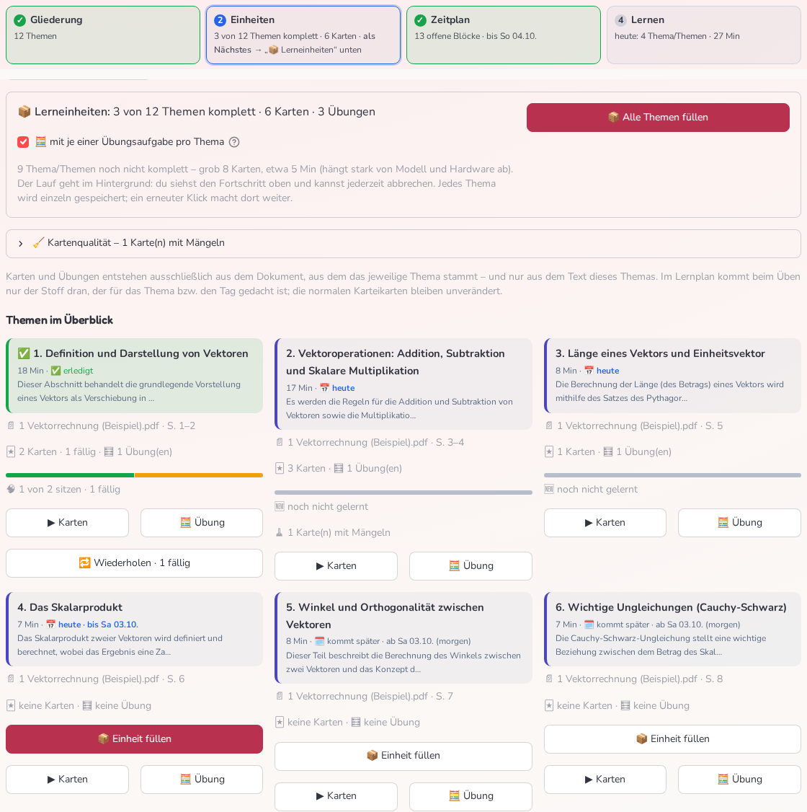
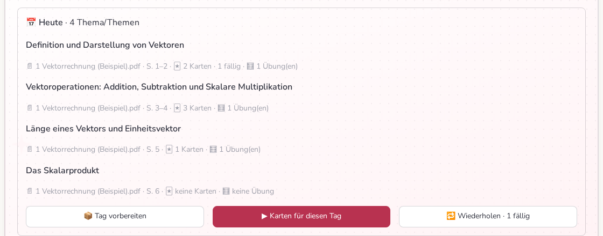
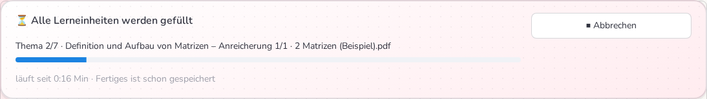
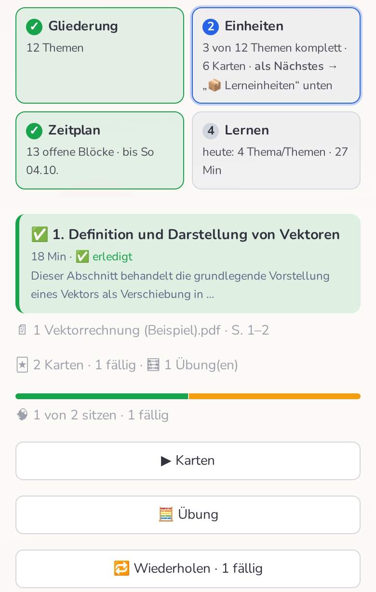
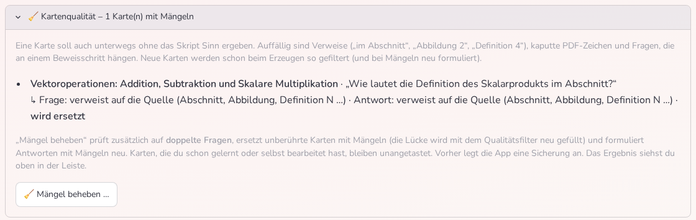

# 📋 Lernplan: von der Gliederung zum Lerntag

Die Seite **📋 Lernplan** macht aus deinen Unterlagen einen Plan, der auf Tage verteilt ist –
und bereitet für jedes Thema **Karteikarten und eine Übungsaufgabe** vor, **nur aus dem Stoff
dieses Themas**. Nichts davon läuft von allein: Du löst jeden Schritt per Knopfdruck aus, die
App sagt dir, was als Nächstes dran ist.

> Die Bilder zeigen ausgedachte Beispiel-Skripte („Vektorrechnung“, „Matrizen“) – keine echten
> Unterlagen. Die wissenschaftliche Herleitung der Zeitschätzung steht in
> [LERNPLAN_FORSCHUNG.md](LERNPLAN_FORSCHUNG.md).

## Der Ablauf in vier Schritten

Oben auf der Seite zeigt die **Schrittleiste**, wo dein Plan steht. Genau ein Schritt ist mit
*„als Nächstes“* markiert.

| Schritt | Was passiert | Knopf |
|---|---|---|
| **① Gliederung** | Die KI ordnet deine Unterlagen zu **Themen**. Ein Thema stammt (bei neuen Gliederungen) immer aus **genau einem Dokument**. Du kannst Titel, Reihenfolge und Minuten in der Tabelle ändern. | 🧠 *Gliederung erzeugen* / 🔄 *neu erzeugen* |
| **② Einheiten** | Zu jedem Thema entstehen Karteikarten und eine Übungsaufgabe – aus dem Text dieses Themas. | 📦 *Einheit füllen* (je Thema) oder 📦 *Alle Themen füllen* |
| **③ Zeitplan** | Die Themen werden in Lernblöcke (Pomodoro-Größe) auf Tage verteilt – mit deinem Zeitbudget pro Tag, Ruhetagen und optionalem Zieldatum. | 📐 *Plan berechnen* |
| **④ Lernen** | Pro Tag: **Tag vorbereiten**, **Karten für diesen Tag**, **Wiederholen**; pro Block: 🍅 Pomodoro, Karten, Übung, Skript, Verstehen. | im Bereich 🗓️ *Zeitplan* |

Ändert sich später etwas (neue Gliederung, andere Minuten, neues Thema), erkennt die Seite, dass
der gespeicherte Zeitplan **veraltet** ist, und sagt dir warum – dann genügt ein Klick auf
📐 *Plan berechnen*. **Erledigte Blöcke bleiben dabei erhalten** (samt Pomodoro-Herkunft und
gemessener Zeit); ihre Minuten werden dem Thema gutgeschrieben, damit nichts doppelt eingeplant wird.

### Der Lerntag (Schritt ④)

Im Bereich **🗓️ Zeitplan** zeigt das **Heute**-Panel die Themen des Tages (steht heute nichts an: des
nächsten Lerntags) mit Quelle und Füllstand – und drei Knöpfen:

* **📦 Tag vorbereiten** erzeugt die fehlenden Karten und Übungen **nur für diese Themen** (ein Lauf im Hintergrund).
* **▶ Karten für diesen Tag** startet eine Lernrunde mit den Karten genau dieser Themen – fällige zuerst, dann neue.
  Fehlen für ein Thema die Karten, werden sie vorher erzeugt; es kommt nie Stoff aus einem anderen Thema dazu.
* **🔁 Wiederholen** frischt **fällige** Karten aus den **bisherigen** Themen auf (siehe unten).

Darunter stehen die Tage mit ihren Blöcken. Pro Block: 🍅 *Pomodoro* (Zeitmessung, danach gilt der Block als
erledigt), *Karten*, *Übung*, *Skript* (öffnet das Dokument an der Seite, an der das Thema beginnt) und
*Verstehen* (sokratischer Dialog, nur aus dem Dokument des Themas – siehe
[SOKRATISCHER_DIALOG.md](SOKRATISCHER_DIALOG.md)).

## Die drei Regeln, die dein Lernplan einhält

1. **Halbautomatisch.** Es gibt keinen Hintergrund-Zauber: Karten und Übungen entstehen erst, wenn
   du einen Knopf drückst – und du kannst jeden Lauf wieder abbrechen.
2. **Die Referenz ist das Dokument des Themas.** Jede Kachel zeigt, woher das Thema stammt
   („📄 1 Vektorrechnung.pdf · S. 5–7“). Karten, Übungsaufgaben, das Skript und der
   Verstehen-Dialog nutzen **ausschließlich dieses Dokument**.
3. **Im Lernplan kommt nur der Stoff des Themas bzw. Tages dran.** Steht heute „Vektormultiplikation“
   im Plan, tauchen beim Üben keine Matrizen-Karten aus einem anderen Dokument auf – die kommen
   erst, wenn Matrizen dran sind. Fehlen für ein Thema die Karten, wird die Runde **nicht** mit
   fremden Karten aufgefüllt. Die **normalen Karteikarten** (Seite 🎓 *Lernen*) bleiben davon
   unberührt: Dort stehen weiterhin alle deine Karten ganz normal.

## Lerneinheiten füllen (Schritt ②)

**📦 Einheit füllen** erzeugt für ein Thema die fehlenden Karten und eine Übungsaufgabe.
**📦 Alle Themen füllen** macht das nacheinander für alle noch unvollständigen Themen. Optional
schaltest du die Übungsaufgaben ab (*„mit je einer Übungsaufgabe pro Thema“*). Daneben stehen
grobe Erwartungswerte (Anzahl Karten, Minuten) – sie hängen stark von Modell und Rechner ab.

Der Ablauf pro Thema ist derselbe wie beim normalen Lernset, nur auf die Textabschnitte des
Themas beschränkt: **Fragen erzeugen → Karten ernten → Antworten erzeugen → Beleg prüfen**
(eine zweite KI-Prüfung verwirft Antworten, die der Text nicht stützt).

### Der Lauf im Hintergrund

Das Füllen mehrerer Themen dauert (gemessen auf einer GPU mit `gemma4`: grob 3–4 Sekunden pro Karte,
auf schwächerer Hardware deutlich länger – die Seite nennt vorab eine Schätzung). Deshalb läuft
es **im Hintergrund**: Die Seite bleibt bedienbar, und oben erscheint eine Leiste, die beim
Scrollen sichtbar bleibt:

* **⏹ Abbrechen** stoppt nach dem aktuellen Schritt. Was bis dahin fertig ist, **bleibt
  gespeichert**; ein erneuter Klick macht dort weiter, wo der Lauf aufgehört hat.
* Du kannst währenddessen die Seite wechseln – der Lauf gehört dem Server, nicht dem Tab. Wenn du
  zurückkommst, steht dort das Ergebnis. Schließt du den Browser-Tab, wartet der Tab-Close-Wächter (das
  automatische Beenden der App) mit dem Beenden, bis der Lauf fertig ist.
* Während ein Lauf läuft, sind die Füll-Knöpfe und „Gliederung neu erzeugen“ gesperrt (ein
  Grafikspeicher, ein Lauf). Das Modell bleibt über alle Themen geladen und wird erst am Ende
  freigegeben.
* Jedes Thema wird einzeln gespeichert. Auch bei einem Absturz oder zu wenig Grafikspeicher geht
  nichts verloren.

## Der Lernstand je Thema

Jede Kachel zeigt, wo du bei diesem Thema stehst:

* **🃏 / 🧮** – wie viele Karten und Übungen es gibt (und wie viele Karten noch ohne Antwort sind),
* **🧠 5 von 12 sitzen · 3 fällig · 4 neu** mit einem kleinen Balken (grün = sitzt, gelb = fällig,
  grau = neu). *„Sitzt“* heißt: schon geübt und aktuell nicht fällig.
* **🔁 Wiederholen · 3 fällig** – nur wenn es fällige Karten gibt. Es kommen **nur die fälligen
  Karten dieses Themas** dran, keine neuen. Im Bereich *Heute* gibt es denselben Knopf für alle
  **bisherigen Themen** zusammen (die schon dran waren oder angefangen sind) – Themen, die noch nie
  dran waren, werden nie vorgezogen.

Die Seite ist für schmale Bildschirme gebaut – die Schrittleiste bricht in zwei Reihen um, und alle
Knöpfe stehen untereinander:

## Termine auf den Kacheln

| Anzeige | Bedeutung |
|---|---|
| **📅 heute** (ggf. „· bis Fr 09.10.“) | Das Thema steht heute im Plan. |
| **🗓️ kommt später · ab Do 08.10. (in 6 Tagen)** | Noch nicht dran. |
| **⚠️ überfällig seit Mo 05.10.** | Offene Blöcke liegen in der Vergangenheit (dann hilft 🔧 *Plan reparieren*). |
| **✅ erledigt** | Alle Blöcke des Themas sind abgehakt. |
| **🗓️ noch nicht eingeplant** | Das Thema hat noch keine Termine – 📐 *Plan berechnen*. |

## Zieldatum, Klausur und die Zeitschätzung

Unter dem Plan stehen Klartext-Hinweise mit den echten Zahlen:

* **Ohne Zieldatum** verteilt die App den Stoff ab heute Tag für Tag („3928 Min bei 60 Min/Tag ergeben
  62 Kalendertage – letzter Tag: 05.12.2026“).
* Ist für das Fach ein **Klausurdatum** hinterlegt (Seite *Fortschritt*), das der Plan nicht kennt, bietet die Seite
  **📅 Klausurdatum als Zieldatum übernehmen** an – und warnt, wenn der Plan nicht bis zur Klausur reicht
  oder das Zieldatum danach liegt.
* Bei zu knappem Zieldatum steht ehrlich da, wie viele Minuten **fehlen**, und welches Tempo du
  mindestens bräuchtest (im Vergleich zur empfohlenen Tagesobergrenze).
* **ℹ️ Wie kommt die Zeitschätzung zustande?** (unter *Gliederung*) rechnet an einem Beispielthema vor:
  Lesen + Üben, mal Korrekturfaktor, plus bis zu +40 % für formellastigen Stoff. Es ist eine
  Faustformel; die Minuten pro Thema kannst du in der Tabelle ändern, und mit jedem echten
  Pomodoro wird der Faktor genauer.

## Kartenqualität

Eine Karte muss **ohne das Dokument** verständlich sein. Kleine Modelle formulieren aber gern
„Wie lautet die Definition von OD **im Abschnitt**?“ oder „… **nach Definition 4**“. Deshalb prüft die
App Karten automatisch (regelbasiert, ohne KI-Aufruf):

| Mangel | Beispiel |
|---|---|
| Verweis auf die Quelle | „im Abschnitt“, „Abbildung 2“, „Satz 3.2“, „laut Skript“ |
| kaputte PDF-Zeichen | `⎛ ⎞ ⎜⎜⎜`, abgetrennte Vektorpfeile |
| fehlender Kontext | „… die durch die Division bewiesen wird“, „die angegebenen Bewegungen“, „in diesem Kontext“ |
| zu unbestimmt / Antwort wiederholt die Frage | „Was ist das?“ |
| doppelt | zwei Fragen, die fast gleich lauten (Embedding-Ähnlichkeit ≥ 0,89) – beim Erzeugen auf derselben Seite, bei „Mängel beheben“ im ganzen Dokument |

* **Neue Karten** werden schon beim Erzeugen gefiltert: Eine mangelhafte Frage wird verworfen und
  mit einem gezielten Hinweis **neu formuliert** (bis zu `CARD_QUALITY_RETRIES` = 2 Neuversuche); Antworten
  mit Verweis auf „Definition 4“ werden ebenfalls bis zu zweimal neu erzeugt (behalten wird die Fassung mit
  weniger Mängeln). Doppelte Fragen werden beim Erzeugen **auf derselben Seite** ausgelassen.
* **Vorhandene Karten** prüft der Bereich **🧹 Kartenqualität**: Er listet auffällige Karten mit
  dem Mangel.

  

  **🧹 Mängel beheben** (mit Rückfrage) prüft zusätzlich auf Dubletten, ersetzt Karten mit
  Mangel in der **Frage** und formuliert Antworten mit Mangel neu.
  **Karten, die du schon geübt oder selbst bearbeitet hast, werden nie angefasst.** Vor dem Löschen
  legt die App eine Datensicherung an; scheitert die Neuerzeugung einer Antwort, bleibt die alte stehen.
* **Inhaltlich falsche Antworten** erkennt keine Regel – dafür gibt es auf der Seite 🎓 *Lernen* (Expertenmodus)
  **🔎 Belege prüfen**: Eine zweite KI-Prüfung vergleicht gespeicherte Antworten mit dem Textabschnitt und entfernt
  die, die er klar nicht stützt; **🤖 Antworten erzeugen** füllt die Lücken danach neu. Eine Karte ohne Antwort zeigt
  auf der Rückseite die Quellenstelle – das ist besser als eine falsche Antwort zu lernen. (Bei Karten aus
  verstümmeltem PDF-Text bleibt die Antwort manchmal leer: dort hilft nur eine bessere Quelle oder das Ersetzen
  der Karte über **Mängel beheben**.)

## Wie Karten und Themen zusammenhängen

Es gibt **keine eigene Zuordnungstabelle**: Ein Thema kennt seine Quellen als Liste
`{Dokument, Fundstelle}` (z. B. „Seite 5“), und jede Karte trägt dieselbe Fundstelle als *Thema*. Karten eines
Themas sind also die Karten dieses Dokuments mit passender Fundstelle. Das gilt für **bestehende** Karten
genauso wie für neue, und eine geänderte Gliederung entwertet keine Karten (sie hängen an Seiten, nicht an
Titeln).

Fasst die KI mehrere Abschnitte zusammen, steht in der Fundstelle „A / B“ (Menge) oder „A … B“ (Bereich) – die
Seite löst das auf. Gleiche Themen-Titel macht die Gliederung eindeutig, indem sie den Seitenbereich anhängt
(„Erweiterungen (S. 8–11)“); Übungen werden über den Titel zugeordnet.

## Einstellungen

Einige Werte stehen unter ⚙️ *Einstellungen → 📋 Lernplan* (z. B. der Zeitfaktor); alle sind in `data/config.json` änderbar.

| Einstellung | Standard | Wirkung |
|---|---|---|
| `PLAN_BLOCK_MIN` | 25 | Größe eines Lernblocks (ein Pomodoro) |
| `PLAN_MAX_DAILY_FOCUS_MIN` | 240 | Tagesobergrenze fokussierten Lernens (mehr Eingabe wird gedeckelt) |
| `PLAN_MAX_OUTLINE_SECTIONS` | 15 | **Richtwert** für die Zahl der Themen. Bei einer Abschnittsgruppe die Obergrenze; verteilt sich der Stoff auf mehrere Gruppen (viele Abschnitte, mehrere Dokumente), bekommt jede ihren Anteil – mindestens ein Thema je 6 Abschnitte –, und die Gesamtzahl liegt darüber (Beispiel: 8 PDFs → 38 Themen). |
| `PLAN_OUTLINE_BATCH_ENTRIES` | 30 | Wie viele Abschnitte die KI in **einem** Durchlauf ordnet. Mehr werden dokumentweise in Gruppen geteilt – sonst ordnet ein kleines Modell nur die ersten ~25 von 160 Abschnitten zu. |
| `PLAN_TOPIC_MAX_CHARS` | 12000 | Ab dieser Textmenge wird ein Thema geteilt („… (S. 6–11)“); 0 = nie |
| `PLAN_TIME_FACTOR` | 1,5 | Startwert des Zeit-Korrekturfaktors (wird mit echten Pomodoro-Zeiten kalibriert) |
| `CARD_QUALITY_RETRIES` | 2 | Neuversuche bei mangelhaften Fragen/Antworten (0 = nur verwerfen) |

## Wenn etwas nicht klappt

* **„Zu wenig freier Grafikspeicher“** – der Lauf bricht mit dieser Meldung ab, bereits fertige Themen bleiben.
  Andere GPU-Programme schließen und erneut starten, oder ein kleineres Modell wählen (*Einstellungen*).
* **„Thema ohne indexierte Textabschnitte“** – das Quelldokument wurde gelöscht oder neu eingelesen. Gliederung neu erzeugen.
* **⚠️ „… Themen stammen aus mehreren Dokumenten“** – eine alte Gliederung. **🔄 Gliederung neu erzeugen**
  bildet dokumentreine Themen (Karten, Termine und erledigte Blöcke bleiben, siehe oben).
* **„Der Zeitplan ist veraltet“** – 📐 *Plan berechnen*.
* **Ein Thema hat keine Karten, obwohl der Lauf fertig ist** – alle Fragen des Themas wurden als mangelhaft oder doppelt
  aussortiert. 📦 *Einheit füllen* versucht es erneut (die Zähler stehen in der Rückmeldung: „🧹 n Frage(n) mit Mängeln aussortiert“).

## Für Entwickler

| Datei | Aufgabe |
|---|---|
| `ragapp/study_plan.py` | Gliederung (`generate_outline`, Gruppen, Teilung, eindeutige Titel), Zeitschätzung, `build_schedule`, `plan_staleness`, `deadline_hints` |
| `ragapp/plan_cards.py` | Thema ↔ Karten/Übungen: Fundstellen, Kartenstand, Lernstand, Termine, Qualitätsprüfung/-reparatur, `fill_plan_cards`, Schrittleiste, Hintergrund-Start |
| `ragapp/card_quality.py` | regelbasierte Kartenprüfung + Dublettenerkennung (offline, ohne KI) |
| `ragapp/jobs.py` | Hintergrundaufträge: Thread, Fortschritt, kooperatives Abbrechen, Ergebnis (ohne Streamlit-Import) |
| `ragapp/llm.py` | `llm_task`: zählt aktive Aufgaben über alle Threads – nur die letzte gibt das Modell frei |
| `ragapp/ui/pages/11_📋_Lernplan.py` | die Seite (Fragment mit `run_every=2` für die Fortschrittsleiste) |

Tests: `tests/test_plan_cards.py`, `test_jobs.py`, `test_card_quality.py`, `test_study_plan_hints.py`, `test_enrich_quality.py`,
`test_question_gen_quality.py`. Hinweise zum Ausführen stehen in [CONTRIBUTING.md](../CONTRIBUTING.md).
