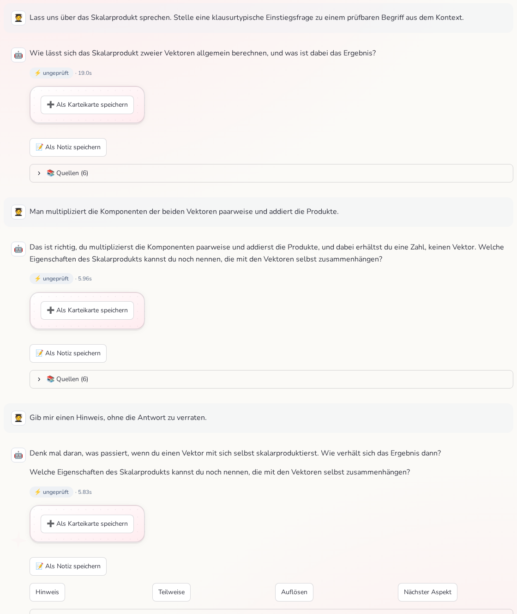

# 🧭 Sokratischer Dialog im Chat

Im **💬 Chat** wählst du den **Gesprächsmodus**:

| Modus | Verhalten |
|---|---|
| 🎯 **Strikt** | Antwortet knapp und nur mit dem, was in deinen Unterlagen steht – mit Quellenangaben. |
| 🗣️ **Tutor-Gespräch** | Erklärt im Gespräch, gewichtet Rückfragen und gibt einen Lernüberblick. |
| 🧭 **Sokratischer Dialog** | Fragt **dich**: erst ein Thema vereinbaren, dann stellt die KI klausurtypische Fragen aus deinen Unterlagen, reagiert auf deine Antworten und löst auf Wunsch auf. |



> Die Beispiel-Unterlagen im Bild sind ausgedacht. Die Antworten stammen vom echten Modell.

Im sokratischen Modus gibt es unter jeder offenen Frage vier Impulse:

* **Hinweis** – ein kurzer Denkanstoß, der die Lösung nicht verrät (danach dieselbe Frage, einfacher),
* **Teilweise** – „ich weiß nur einen Teil“ (die KI ermutigt, den Teil zu nennen),
* **Auflösen** – die KI erklärt die Antwort aus deinen Unterlagen (mit Quelle),
* **Nächster Aspekt** – zu einer anderen Frage desselben Themas.

War die letzte Antwort schon eine Auflösung, bleibt nur **Nächster Aspekt** – ein „Hinweis“ ohne
offene Frage ergibt keinen Sinn. Antwortest du frei, reagiert die KI auf **deinen** Text („richtig /
teilweise / falsch, weil …“) und stellt genau eine Anschlussfrage. Nach
`SOKRATISCH_RESOLVE_AFTER_QUESTIONS` (Standard: 3) freien Antworten in Folge löst sie von selbst
auf, damit du nicht ewig im Kreis gefragt wirst; ein ausdrücklicher Impuls hat immer Vorrang.

## Was früher schiefging – und warum

**Beobachtung (echter Chat, gemma3:4b, Temperatur 0,1):** Ab dem dritten Zug gab die KI ihre
eigene letzte Antwort fast wörtlich wieder – egal, ob „Hinweis“, „Löse es auf“ oder „Nächster
Aspekt“ gedrückt wurde. Am Ende stand derselbe Text sechsmal im Verlauf. Der Dialog „blieb
zwischen zwei Fragen hängen“.

**Ursache:** Der Verlauf ging als Chat-Turns ins Modell. Kleine Modelle **kopieren** das Muster ihrer
eigenen letzten Antworten („Das ist ein guter erster Schritt … Können Sie mir noch sagen …?“) und
ignorieren eine Anweisung am Ende der Nachricht. Mit dem exakten Verlauf ließ sich das bit-genau
nachstellen.

**Ein größeres Modell allein hilft nicht:** qwen2.5:14b und gemma4 wiederholten im alten Aufbau in
3 von 9 Zügen, nur gpt-oss:20b in 1 von 9. Die Lösung muss also **im Code** liegen, nicht im
Modell.

## So funktioniert ein Zug heute

Alles Wichtige steckt in `ragapp/graph/socratic_turn.py` und `rag_graph._sokratisch_intent`:

1. **Gesprächsstand statt Verlauf.** Das Modell bekommt keine früheren Chat-Turns, sondern einen
   knappen Stand in **einer** Nachricht: die offene Frage, deine bisherigen Antworten, die schon
   gestellten Fragen (nicht wiederholen). Es gibt nichts mehr zum Weiterkopieren.
2. **Der Code entscheidet die Aufgabe.** Aus deiner Eingabe und dem Verlauf wird die Absicht
   bestimmt – `start`, `hint`, `partial`, `resolve`, `next` oder `answer` – plus Sonderfälle
   (Beschwerde „du wiederholst dich“, schon aufgelöst, zu viele Hinweise, Antwort-Serie). Das
   Modell bekommt genau **eine** passende Aufgabe.
3. **Die Antwort wird geprüft.** Verworfen wird u. a. eine Antwort, die
   * eine frühere fast wörtlich wiederholt (Ähnlichkeit ≥ 0,8),
   * eine schon gestellte Frage noch einmal stellt (≥ 0,75),
   * trotz „Auflösen“ mit einer Frage endet,
   * auf „Abbildung 2“, „Quelle 3“ oder „Definition 4“ verweist, die du im Chat nicht siehst,
   * über „die/den Studierenden“ in der dritten Person spricht oder gar keine Frage enthält.
4. **Neuversuch mit mehr Streuung.** Bei einem Mangel versucht es die App bis zu dreimal – jedes
   Mal mit höherer Temperatur, einer Wiederholungsstrafe und einem Hinweis, was an der letzten
   Fassung nicht stimmte.
5. **Ehrlicher Rückfall.** Bleibt auch der beste Versuch unbrauchbar, kommt keine zweite Kopie,
   sondern eine feste Antwort: bei „Auflösen“ die passende Stelle direkt aus deinen Unterlagen,
   sonst die Bitte, das Thema in eigenen Worten zu erklären (eine echte Frage, damit der Dialog
   offen bleibt).

Der sokratische Modus **streamt nicht** – die Antwort wird erst geprüft und dann angezeigt (kein
„Tippen“ einer Fassung, die gleich verworfen wird).

## Wenn der Dialog doch einmal hängt

Jeder Zug schreibt in `data/logs/queries.jsonl` ein Feld **`socratic`**:

```json
{"kind": "resolve", "note": "hint_limit", "attempts": 2, "problems": [], "fallback": false}
```

* `kind` / `note` – was der Code für diesen Zug entschieden hat,
* `attempts` – wie viele Fassungen nötig waren,
* `problems` – Mängel der **gewählten** Fassung (leer = sauber),
* `fallback` – `true`, wenn die feste Rückfallantwort kam.

Eine Häufung von `attempts: 3` oder `fallback: true` zeigt ein Modell, das mit der Aufgabe kämpft –
dann in ⚙️ *Einstellungen* ein anderes Modell wählen. Den Chat selbst findest du in
`data/manifest.db` (Tabelle `chat_sessions`, Spalte `messages_json`); das Nachspielen mit dem echten
Modell ist der schnellste Weg, einen neuen Fehler zu verstehen.

## Für Entwickler

| Datei | Aufgabe |
|---|---|
| `ragapp/graph/socratic_turn.py` | Gesprächsstand, Prompt, Prüfung, Neuversuch, Rückfall (reine Funktionen – das LLM wird übergeben) |
| `ragapp/graph/rag_graph.py` | `_sokratisch_intent` (Absicht), `_sokratisch_answer`; neue Felder im `RAGState` müssen **im TypedDict stehen** – LangGraph verwirft unbekannte Schlüssel stillschweigend |
| `ragapp/graph/prompts.py` | `SOKRATISCH_TURN_*` (Aufgaben je Absicht, Sonderfall-Hinweise) |
| `ragapp/ui/pages/0_💬_Chat.py` | Modus-Wahl, Impuls-Knöpfe (`_socratic_chips`) |

Die Texte der Impuls-Knöpfe („Hinweis“, „Auflösen“ …) dürfen **nicht** geändert werden: Der
Verstehen-Dialog des Lernplans erkennt Steuerzeilen daran (`student_flow._VERSTEHEN_CTRL`).
Tests: `tests/test_socratic_turn.py` (Gesprächsstand, Prüfung, Neuversuch, Rückfall) und
`tests/test_rag_graph_modes.py` (Absicht, Zustandsmaschine, Zählung der Impulse).
